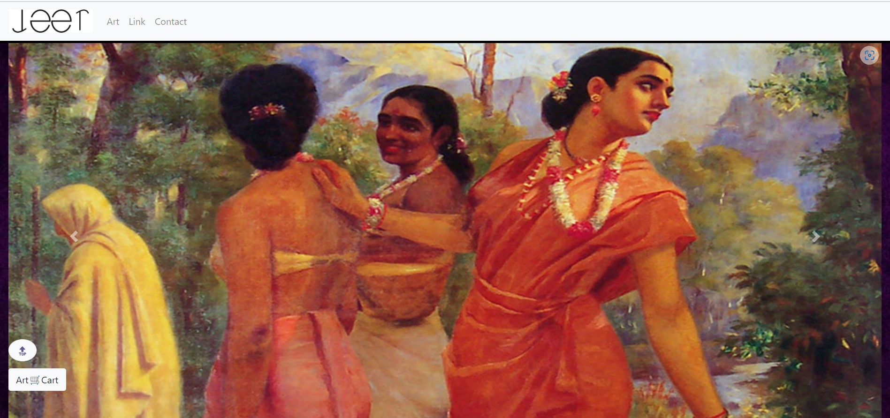
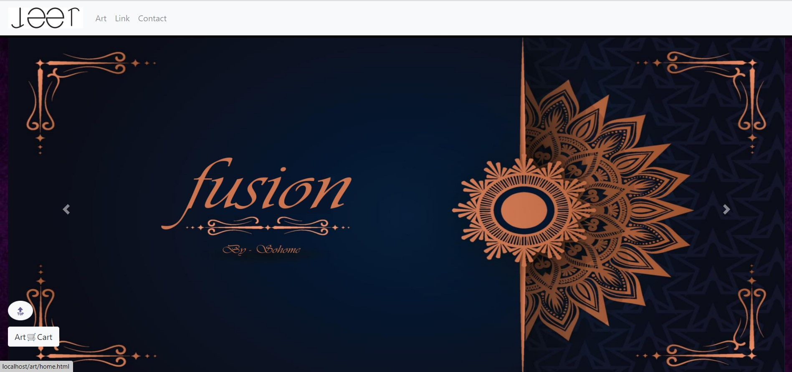
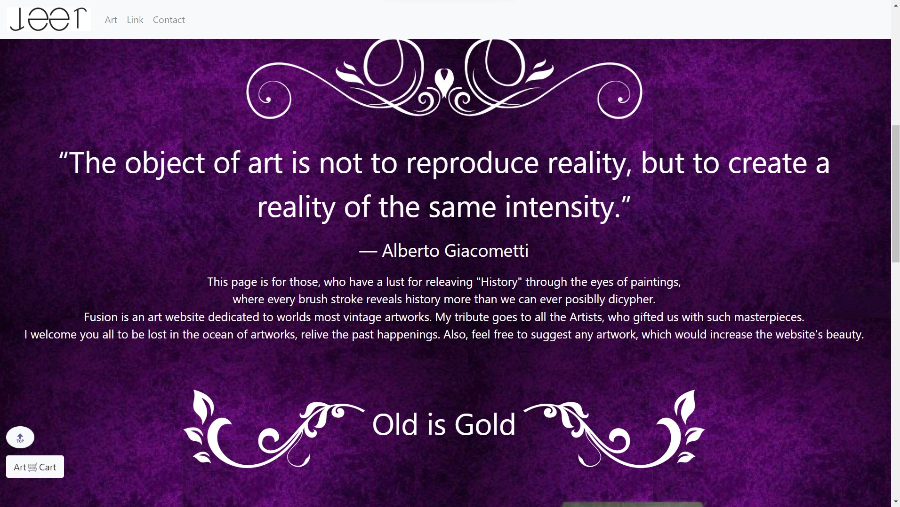
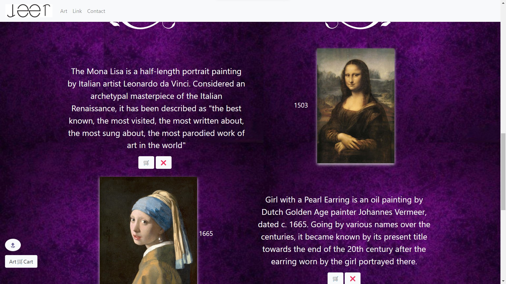
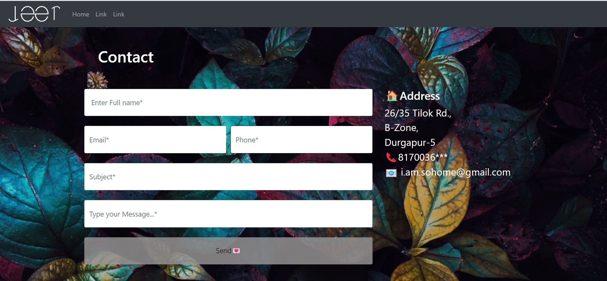

# Fusion

Fusion is a model Art gallery website.


## 🛠 Tools
```
HTML, CSS, Javascript, PHP, MySql..
```


## Features
- Art from different hiatorical era.
- Special tribute to Artists.
- Model purchase cart.


## Screenshots

<html>

<p float="left">






</p>

</html>


## Feedback

If you have any feedback, please reach out to us at i.am.sohome@gmail.com


## 🔗 Links
[](https://www.linkedin.com/in/sohome-chowdhury)
